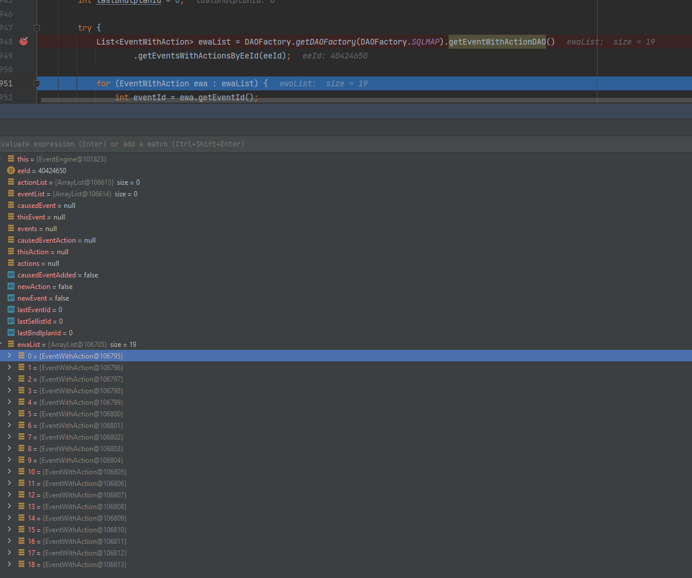
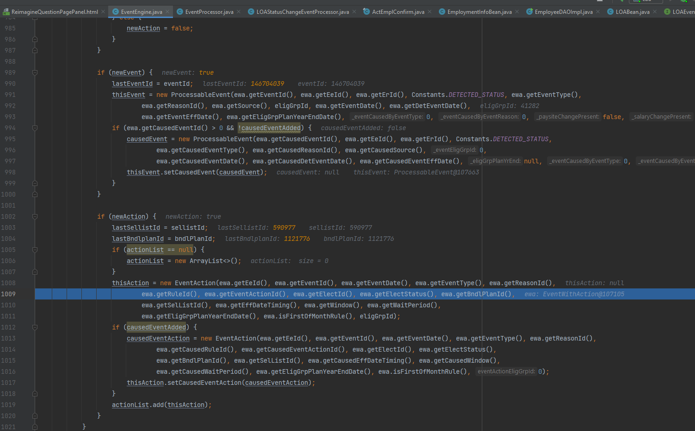

# LOA Analysis

## 📌 Objective

NOTE: This analysis is done from the perspective of changing an employment status from MSS. We're hoping this will give us insight into a better solution with the Leave Integration project.

## Overview 
### Brief snapshot of the stack trace:


## 1. ActEmplConfirm

The flow starts with the user making a employment status change (in this case 'active -> LOA unpaid leave')

When the user continues,  **ActEmplConfirm#hraPlusPerform** method is called. This is where we call the EmploymentInfoBean#save method as shown below:


## 2. EmploymentInfoBean/susemp_process sproc

In EmploymentInfoBean#save method, EmployeeDAOImpl is called to sp_susemp_process.
The actual changes are being commited through this huge sproc... 


Here is the stack when calling the susemp stored procedure:


I think this is where a detect_event record is added.

## 3. EventEngine
Then the record gets picked up by the **EventEngine**. Where we eventually call a method, EventEngine#processEventsWithActionsToProcess. 


As you can see on line 948, a DB call is made to gather a list of events with actions associated with them. This line calls thefollowing query:

```
get-events-with-actions-by-eeid

# Eventually calls the following sproc
call ues.dbo.GetEventsWithActionsByEeId(#value#)
```
[Link to Proc_GetEventsWithActionsByEeId.sql](https://github.com/AlightEngineering/CBA_cba-db-sources/blob/530de2c2a98b5e111cd52cd6aaf1a6a156494c5f/ues/Proc_GetEventsWithActionsByEeId.sql#L9)

<mark>^^ This might be the key to this whole thing</mark>

The LOA gets processed here

Most of the event processing occurs in EventEngine. 

## 4. GetEventsWithActionsToProcess Sproc
This stored procedure gathers the necessary data from the LOA event tables set in RI. This is the **new** way of handling LOA events.

### OUTPUT:


| Insert Column                             | Source Table                          | Source Column / Expression                                                                 |
|------------------------------------------|----------------------------------------|---------------------------------------------------------------------------------------------|
| evtId                                    | `ues.dbo.DetectEvents`                | `detevt_id`                                                                                 |
| evtEeId                                  | `ues.dbo.DetectEvents`                | `detevt_eeid`                                                                               |
| evtErId                                  | *Variable*                             | `@ee_erid`                                                                                  |
| evtType                                  | `ues.dbo.DetectEvents`                | `detevt_type`                                                                               |
| evtReasonId                              | `ues.dbo.DetectEvents`                | `detevt_reasonid`                                                                           |
| evtSource                                | `ues.dbo.DetectEvents`                | `detevt_source`                                                                             |
| evtEligGrpId                             | `ues.dbo.DetectEvents`                | `detevt_eliggrpid`                                                                          |
| evtDate                                  | *Expression*                           | `CASE` using `detevt_type`, `loalds_id`, `loaold_original_leave_date`, etc.                |
| evtDetDate                               | `ues.dbo.DetectEvents`                | `detevt_detdate`                                                                            |
| evtCause                                 | `ues.dbo.DetectEvents`                | `detevt_causeEvtId`                                                                         |
| eligGrpPlanYrEnd                         | `ues.dbo.EligGroups`                  | `eliggrp_planyr_end`                                                                        |
| procAction                               | *Literal*                              | `4`                                                                                         |
| evtActElectId                            | `ues.dbo.EmployeeElections`           | `elect_id`                                                                                  |
| evtActAction                             | `ues.dbo.LOAActionCodes`              | `loaac_constants_id`                                                                        |
| evtActElectStatus                        | `ues.dbo.EmployeeElections`           | `elect_status`                                                                              |
| evtActEffDateTiming                      | `ues.dbo.LOAEffectiveDateTimingCodes` | `loaedtc_constants_id`                                                                      |
| evtActActionWindow                       | `ues.dbo.LOAEvents`                   | `loae_process_window`                                                                       |
| evtActLifeStatusChangeEffDateWaitPeriod  | *Function*                             | `dbo.udf_GetLOAWaitingPeriodValue(...)`                                                     |
| evtActBndlPlanId                         | `ues.dbo.EmployeeElections`           | `elect_bndlplanid`                                                                          |
| evtActRuleId                             | `ues.dbo.LOAEvents`                   | `loae_id`                                                                                   |
| evtActSelListId                          | `ues.dbo.EmployeeElections`           | `elect_sellistid`                                                                           |
| evtEffDate                               | *Expression*                           | `CASE` using `ues.dbo.GetTermEffectiveDatePayroll(...)` or `ues.dbo.GetEventEffectiveDate(...)` |
| causedEvtId                              | *NULL*                                 | `NULL`                                                                                      |
| causedEvtType                            | *NULL*                                 | `NULL`                                                                                      |
| causedEvtReasonId                        | *NULL*                                 | `NULL`                                                                                      |
| causedEvtSource                          | *NULL*                                 | `NULL`                                                                                      |
| causedEvtEligGrpId                       | *NULL*                                 | `NULL`                                                                                      |
| causedEvtDate                            | *NULL*                                 | `NULL`                                                                                      |
| causedEvtDetDate                         | *NULL*                                 | `NULL`                                                                                      |
| causedEvtAction                          | *NULL*                                 | `NULL`                                                                                      |
| causedEvtEffDateTiming                   | *NULL*                                 | `NULL`                                                                                      |
| causedEvtWindow                          | *NULL*                                 | `NULL`                                                                                      |
| causedEvtLSChangeEffDateWaitingPeriod    | *NULL*                                 | `NULL`                                                                                      |
| causedEvtRuleId                          | *NULL*                                 | `NULL`                                                                                      |
| causedEvtEffDate                         | *NULL*                                 | `NULL`                                                                                      |
| evtFirstOfMonthRule                      | *NULL*                                 | `NULL`                                                                                      |
| electTranDate                            | `ues.dbo.EmployeeElections`           | `elect_tran_date`                                                                           |

The columns that seem important are the following:
- evtActAction (the action - terminate, keep, etc.)
- evtActRuleId (the record on LOAEvents - sort of the main table  holding lots of foreign keys)

Again, as mentioned in Section 3 (EventEngine), EventEngine calls this stored procedure, Here is a screenshot of the results: 


With these results, the method initializes an **ProcessableEvent** as 'thisEvent'. Then it initializes an **EventAction** object and sets it as 'thisEvent's action. 



EventAction thisAction is set to thisEvent:
```java
    if (thisEvent != null) {
        if (actionList != null && !actionList.isEmpty()) {
            actions = new EventAction[actionList.size()];
            actions = actionList.toArray(actions);
            thisEvent.setActions(actions);
        }
        eventList.add(thisEvent);
    }
```
## 5. Back to EventEngine
Then, we process those events with actions with the following call:
```java
    try {
        actEvents = this.getEventsWithActionsToProcess(eeId);
        boolean cobraLifeEventOpen = COBRAUtil.isCobraLifeEventOpen(eeId);
        // processing the event and actions we JUST got from the db!
        actions = this.processEventsWithActions(actEvents, processedByAnalysisEngine, 
                                                employeeTermination, cobraLifeEventOpen);
    } catch (final Exception e) {
        eventEngineLogger.error("Error processing events with actions for ee_id=" + eeId, e);
    }
```

**EventEngine#processEventsWithActions** eventually calls **EventProcessor#processEventsWithActions** which simply iterates through an array of provided PorcessableEvent and calls **EventProcessor#processOneEvent**

```java
if (events != null) {
    for (int i = 0; i < events.length; i++) {
        // Calls EventProcessor#processOneEvent
        list.addAll(processOneEvent(events[i], 
                                    processedByAnalysisEngine,
                                    user,
                                    employeeTermination,
                                    cobraLifeEventOpen));
    }
}
```

In  **EventProcessor#processOneEvent**, 


## ✅ TODO
- check out the logic on how EventActions are generated.
- figure out what sp_susemp_process does

